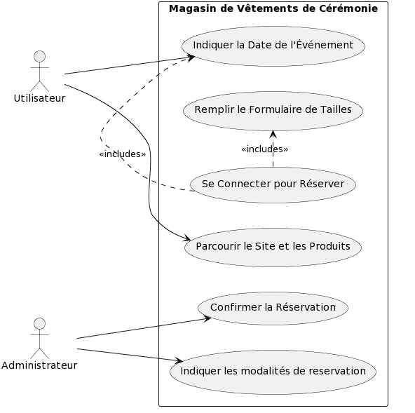
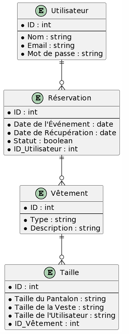

# Magasin de Location de Costumes de Cérémonie

## À propos du projet

Ce projet est une application web pour un magasin de location de costumes de cérémonie. L'application permet aux utilisateurs de parcourir, réserver et louer une variété de costumes pour différentes occasions. Le front-end est développé avec React, offrant une expérience utilisateur interactive et moderne, tandis que le back-end utilise ? pour gérer l'API, les données et les processus métier.

## Fonctionnalités

- **Navigation des Costumes** : Les utilisateurs peuvent parcourir les costumes disponibles par catégorie, taille, et couleur.
- **Réservation en Ligne** : Les utilisateurs peuvent réserver un costume pour des dates spécifiques.
- **Gestion des Utilisateurs** : Inscription, connexion et gestion des profils utilisateurs.
- **Panneau d'Administration** : Un panneau pour gérer les stocks, les réservations, et visualiser les statistiques.

## Technologies Utilisées

- **Front-End** :
  - React
  - React Router (pour la navigation)
- **Back-End** :
  - 
  - PostgreSQL (base de données)
  - JWT (Authentification)

## Configuration et Installation

Assurez-vous d'avoir Node.js, Ruby et PostgreSQL installés sur votre machine avant de commencer.

### Configuration du Back-End 

1. Cloner le dépôt du back-end.

### Configuration du Front-End (React)

1. Cloner le dépôt du front-end.
2. Installer les dépendances : `npm install`
3. Démarrer l'application React : `npm start`
4. Accéder à l'application via `http://localhost:3000` dans votre navigateur.

## Contribuer

Les contributions sont les bienvenues. Veuillez suivre les étapes suivantes pour contribuer :

1. Forker le projet
2. Créer une branche pour votre fonctionnalité (`git checkout -b feature/AmazingFeature`)
3. Commit vos changements (`git commit -m 'Ajout de quelque chose d'incroyable'`)
4. Push sur la branche (`git push origin feature/AmazingFeature`)
5. Ouvrir une Pull Request

## Diagram Cas d'utilisation

## Diagram Entité (DB)

## Diagram de sequence 

## Licence

Ce projet est sous licence GPL.

## Contact

 [andrieu.ps@gmail.com](mailto:andrieu.ps@gmail.com)

